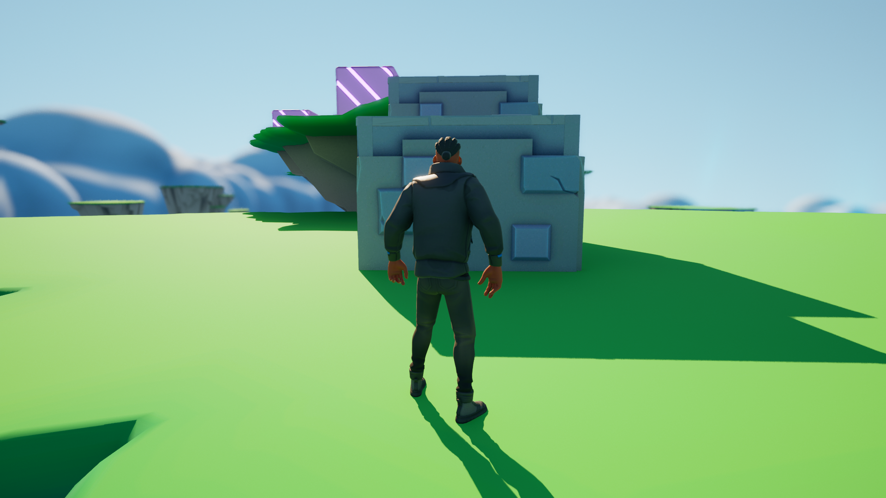
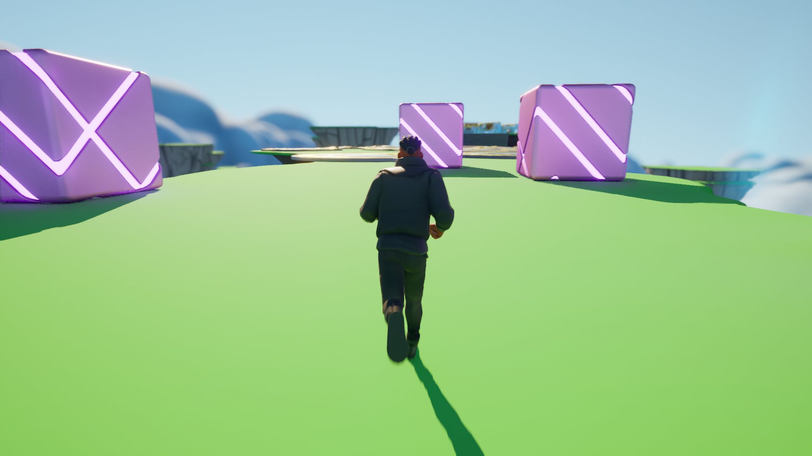
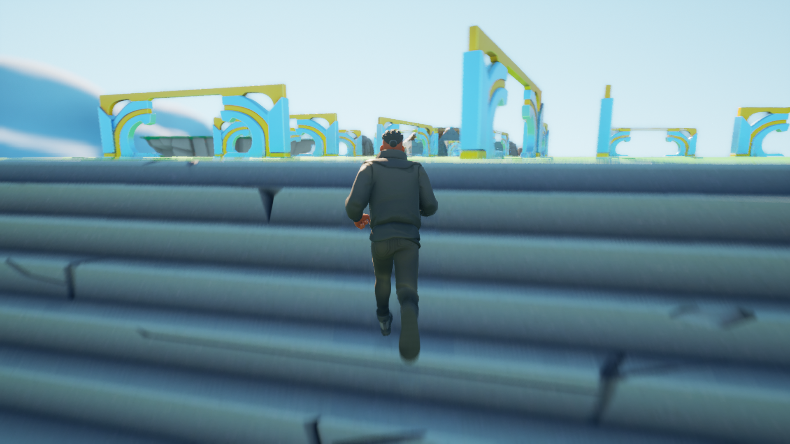
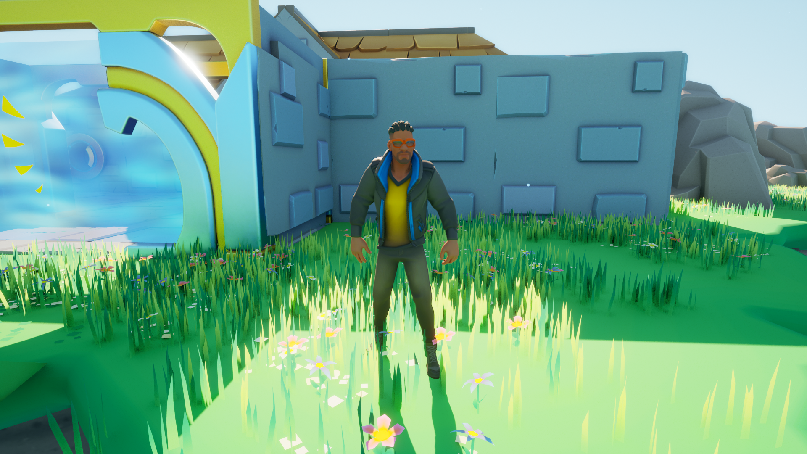
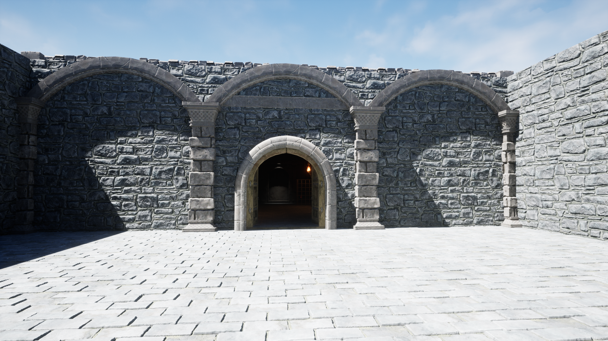
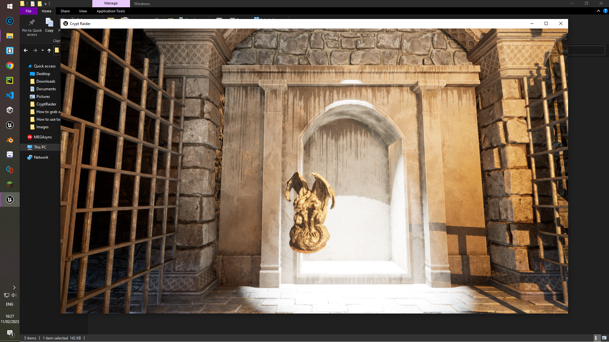
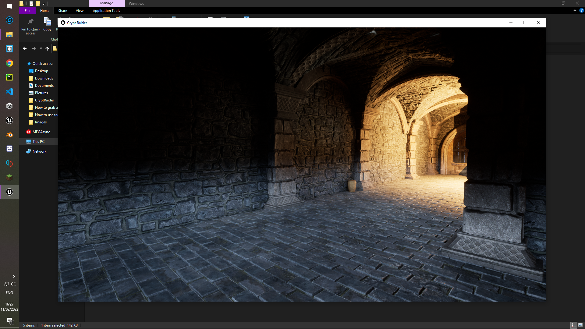

<!-- PORTFOLIO TITLE -->
# Game-Development-Portfolio

<!-- PORTFOLIO WORKS -->

# Unity - C#
- Pong

Repository link (instructions and download): https://github.com/DamienLovemore/Pong---Game

- Zig Zag

Repository link (instructions and download): https://github.com/DamienLovemore/Zig-Zag---Game

- Jumping Ball

Repository link (instructions and download): https://github.com/DamienLovemore/Jumping-Ball---Game

- Delivery Driver

Repository link (instructions and download): https://github.com/DamienLovemore/DeliveryDriver---Game

- Snow Boarder

Repository link (instructions and download): https://github.com/DamienLovemore/SnowBoarder---Game

- Quiz Master

Repository link (instructions and download): https://github.com/DamienLovemore/QuizMaster---Game

- Tile Vania

Repository link (instructions and download): https://github.com/DamienLovemore/TileVania---Game

- Laser Defender

Repository link (instructions and download): https://github.com/DamienLovemore/Laser-Defender---Game

- Obstacle Course

Repository link (instructions and download): https://github.com/DamienLovemore/Obstacle-Course---Game

- Project Boost

Repository link (instructions and download): https://github.com/DamienLovemore/Project-Boost---Game

- Argon Assault

Repository link (instructions and download): https://github.com/DamienLovemore/Argon-Assault---Game

- Realm Rush

Repository link (instructions and download): https://github.com/DamienLovemore/Realm-Rush---Game

- Zombie Runner

Repository link (instructions and download): https://github.com/DamienLovemore/Zombie-Runner---Game

# Unreal - Blueprint and C++
- Warehouse Wreckage

Repository link (instructions and download): https://github.com/DamienLovemore/WarehouseWreckage---Game

- Obstacle Assault

Repository link (instructions and download): https://github.com/DamienLovemore/ObstacleAssault---Game

- Crypt Raider

Repository link (instructions and download): https://github.com/DamienLovemore/CryptRaider---Game